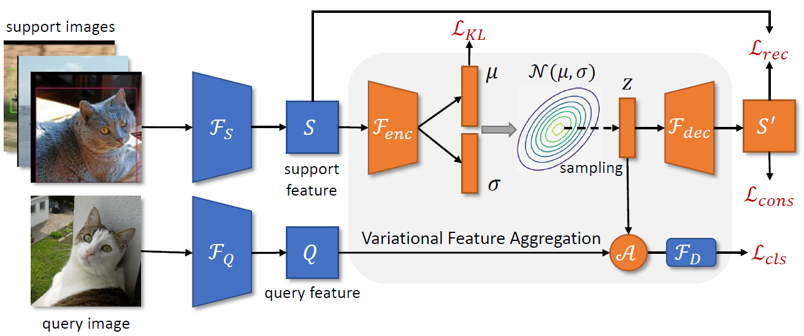

## 다크데이터 4차년도 실증


## VFA



> **Few-Shot Object Detection via Variational Feature Aggregation (AAAI2023)**<br>
> [Jiaming Han](https://csuhan.com), [Yuqiang Ren](https://github.com/Anymake), [Jian Ding](https://dingjiansw101.github.io), [Ke Yan](https://scholar.google.com.hk/citations?user=vWstgn0AAAAJ), [Gui-Song Xia](http://www.captain-whu.com/xia_En.html).<br>
> [arXiv preprint](https://arxiv.org/abs/2301.13411).

Our code is based on [VFA](https://github.com/csuhan/VFA).


### Citation

If you find our work useful for your research, please consider citing:

```BibTeX
@InProceedings{han2023vfa,
    title     = {Few-Shot Object Detection via Variational Feature Aggregation},
    author    = {Han, Jiaming and Ren, Yuqiang and Ding, Jian and Yan, Ke and Xia, Gui-Song},
    booktitle = {Proceedings of the 37th AAAI Conference on Artificial Intelligence (AAAI-23)},
    year      = {2023}
}
```
